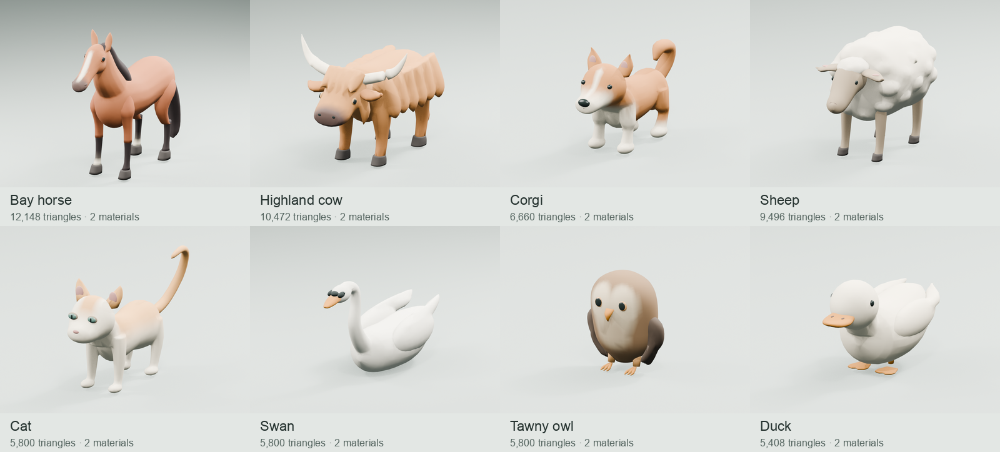

# Animal art set — 2026-10-04

Seventeen individual skinned models cover the eight requested species. They were authored sequentially through live Blender MCP: horses, Highland cows, dogs, sheep, cat, swan, owl and ducks. The [editable Blender studio](../../assets/village/animals-v2/animal-art-studio.blend) contains every final root in the **Animal Art Studio** scene, arranged at native scale. Earlier review candidates are hidden and named `Archive_*`. The [manifest](animals-v2-manifest.json) records exact triangles, file hashes, bounds, materials, design decisions and optional variants.

## Art direction and revisions

The earlier set mixed capsule limbs, bead-like shag/fleece, oversized glossy eyes and different degrees of simplification. Horse joints and chest transitions read as assembled parts. The replacement direction uses long tapered curves, broad continuous body masses, controlled hair/feather shapes, restrained eyes and warm cream/caramel/charcoal colors. The horse establishes the anatomical and material language; smaller animals retain it with species-specific silhouettes.

| Species | Final design and corrections | Useful optional additions |
| --- | --- | --- |
| Horses | Defined withers, chest, shoulder, hocks and tapered muzzle; continuous skin replaces hard limb joins. Broad mane/tail and a smooth facial blaze; bay and grey coats share the cage. | Dapples and further coat variants; native idle/walk/trot/canter and riding tack are implemented. |
| Highland cows | Broad muzzle and swept ivory horns; large directional shag locks blended into a continuous coat. The first fur curtain was revised to follow the body. Copper and flower companion variants. | Cream/black coat, calf, grazing pose. |
| Dogs | Shared warm palette and body language across corgi, Shiba, beagle, Samoyed, collie and shepherd. Slimmer muzzle, smaller eyes and smoother markings replace the first puppy-like proportions. | Further coat markings; gameplay skinning, sit and all existing tricks are implemented. |
| Sheep | Broad soft fleece lobes on a single sculpted volume; clean tapered face, legs and dark hooves. Corrugated/beaded fleece was replaced. Adult and 0.63-scale lamb. | Dark-faced coat, freshly shorn coat, grazing pose. |
| Cat | Slender body, upright curved tail, shorter ears and shallow sage eyes. Eye placement was brought onto the face after the first review. Cream/caramel coat. | Tabby/tuxedo colors; native resting, tail/ear rig and private routines are implemented. |
| Swan | Continuous S-shaped neck and tapered body; broad folded wings unify feather shapes and preserve the elegant silhouette. | Further feather variants; native swimming and flight clips are implemented. |
| Owl | Rounded head/breast, broad folded wings and small shallow eyes. Raised face plates were rejected in the final close-up; soft facial-disk colors now lie on the head surface. | Barn-owl palette and sleeping pose; flight rig is implemented. |
| Ducks | Compact head/body, smooth flat bill, folded wing sculpture and webbed feet. Adult cream duck and 0.60-scale golden duckling. | Mallard palette; native swimming and walking rigs are implemented. |

Each species passed through blockout, proportion, secondary forms, face/color and polish reviews. Live viewport screenshots were used for critiques; saved stage renders retain the process. [The final native-scale cohort](evidence/animals-v2/set-final-native-scale.png) compares all seventeen models under one camera and lighting setup. Portraits use consistent framing for detail comparison rather than indicating relative scale.

## Export contract

All exports use metres, glTF Y-up and +Z forward. Geometry transforms are baked, roots sit at ground level, and files contain one animal with two meshes and two opaque non-metallic PBR materials: `AnimalArt_Matte` (roughness 0.82) and `AnimalArt_Eye` (0.27). Authored vertex colors carry coat patterns without image textures. Packed Smart UV charts are included for future painting; no texture files or custom shader extensions are needed. Each model uses two material draws before any engine batching. A final silhouette review reduced the smaller cat and lamb to 5,800 triangles each while keeping their faces, tail/fleece and native sizes.

The [rig studio](../../assets/village/animals-v2/animal-rig-studio.blend) adds anatomical armatures and normalized vertex weights to the preserved artwork. Both material meshes are skinned. All models have `idle`, `walk` and `pet`; horses add `trot`/`canter`, dogs add `run` and all six tricks, birds add `fly`/`swim`, and the cat adds private nap/stretch/invitation/jump clips. Root motion stays stationary: the Worker controls outdoor world poses and accepted action clocks. The static art studio remains preserved as the editable geometry source.

| Export | Triangles | File size | Blender root |
| --- | ---: | ---: | --- |
| [horse-bay.glb](../../public/village/models/animals-v2/horse-bay.glb) | 12,148 | 734 KiB | [Animal_Horse_bay](../../assets/village/animals-v2/animal-art-studio.blend) |
| [horse-grey.glb](../../public/village/models/animals-v2/horse-grey.glb) | 10,692 | 601 KiB | [Animal_Horse_grey](../../assets/village/animals-v2/animal-art-studio.blend) |
| [highland-copper.glb](../../public/village/models/animals-v2/highland-copper.glb) | 10,472 | 612 KiB | [Animal_Highland_copper](../../assets/village/animals-v2/animal-art-studio.blend) |
| [highland-flower.glb](../../public/village/models/animals-v2/highland-flower.glb) | 11,480 | 657 KiB | [Animal_Highland_flower](../../assets/village/animals-v2/animal-art-studio.blend) |
| [dog-corgi.glb](../../public/village/models/animals-v2/dog-corgi.glb) | 6,660 | 484 KiB | [Animal_Dog_corgi](../../assets/village/animals-v2/animal-art-studio.blend) |
| [dog-shiba.glb](../../public/village/models/animals-v2/dog-shiba.glb) | 6,660 | 478 KiB | [Animal_Dog_shiba](../../assets/village/animals-v2/animal-art-studio.blend) |
| [dog-beagle.glb](../../public/village/models/animals-v2/dog-beagle.glb) | 6,100 | 452 KiB | [Animal_Dog_beagle](../../assets/village/animals-v2/animal-art-studio.blend) |
| [dog-samoyed.glb](../../public/village/models/animals-v2/dog-samoyed.glb) | 7,060 | 504 KiB | [Animal_Dog_samoyed](../../assets/village/animals-v2/animal-art-studio.blend) |
| [dog-collie.glb](../../public/village/models/animals-v2/dog-collie.glb) | 6,932 | 494 KiB | [Animal_Dog_collie](../../assets/village/animals-v2/animal-art-studio.blend) |
| [dog-shepherd.glb](../../public/village/models/animals-v2/dog-shepherd.glb) | 6,532 | 470 KiB | [Animal_Dog_shepherd](../../assets/village/animals-v2/animal-art-studio.blend) |
| [sheep.glb](../../public/village/models/animals-v2/sheep.glb) | 9,496 | 513 KiB | [Animal_Sheep](../../assets/village/animals-v2/animal-art-studio.blend) |
| [lamb.glb](../../public/village/models/animals-v2/lamb.glb) | 5,800 | 358 KiB | [Animal_Lamb](../../assets/village/animals-v2/animal-art-studio.blend) |
| [cat.glb](../../public/village/models/animals-v2/cat.glb) | 5,800 | 394 KiB | [Animal_Cat](../../assets/village/animals-v2/animal-art-studio.blend) |
| [swan.glb](../../public/village/models/animals-v2/swan.glb) | 5,800 | 343 KiB | [Animal_Swan](../../assets/village/animals-v2/animal-art-studio.blend) |
| [owl.glb](../../public/village/models/animals-v2/owl.glb) | 5,800 | 341 KiB | [Animal_Owl](../../assets/village/animals-v2/animal-art-studio.blend) |
| [duck.glb](../../public/village/models/animals-v2/duck.glb) | 5,408 | 337 KiB | [Animal_Duck](../../assets/village/animals-v2/animal-art-studio.blend) |
| [duckling.glb](../../public/village/models/animals-v2/duckling.glb) | 5,408 | 337 KiB | [Animal_Duckling](../../assets/village/animals-v2/animal-art-studio.blend) |

## Editor and runtime use

The local layout editor exposes all seventeen in **Animals**, with rendered previews and position, rotation, scale and named save/reload support. IDs use `animal-<export-name>` (for example `animal-cat`). These decorative instances retain their saved transforms and have no gameplay ownership, movement or collision. Existing gameplay IDs now use the same new models: riding horses, the placed dog breeds, Highland cows, sheep/lamb, owl grove, pond birds and the private cottage cat. Bramble and the white doves retain their earlier artwork because this set contains no replacement for them.

`features/village/animalRig.ts` caches only requested GLBs, clones each skeleton independently and samples native clips without changing the accepted outer world pose. The private cat loads on first cottage entry. Editor previews and placement use the same loader and skeleton-aware clones; batching excludes skins. The canonical playable layout, Worker physics and protected designs are unchanged by this rig pass. Existing pasture Y values were measured against actual elevated grass and already match the ground.

## Reproduction and evidence

Load `scripts/village/animal_art.py` into the live Blender Python namespace, then call one species helper (`horse`, `highland`, `dog`, `sheep`, `cat`, `swan`, `owl`, `duck`) with a stage. Review with `review(root, stage=...)`, capture the MCP viewport, and render with `portrait(stage)`. When re-exporting from the arranged studio, first set the selected root location to `(0, 0, 0)`; restore its gallery position afterward. Call `finish` only after visual review; it merges material groups, unwraps, exports the selected active scene, updates the manifest and saves the studio. It expects this repository path and Blender 5.2.1 LTS. Rebuild one species at a time in an independent root; archive prior task-generated candidates to avoid overwriting unrelated Blender work.

The [evidence index](evidence/animals-v2/README.md) identifies final portraits, stages and local checks. Initial intermediate images are historical drafts; only final portraits and the final cohort represent delivered geometry. Local validation covers actual GLB binary structure, triangle budgets, indices/normals, colors/UV ranges, origin/facing and applied transforms, plus real Three.js loading and editor behavior. UV chart bounds and weighted deformation are tested; exhaustive UV intersection analysis and physical laptop GPU cost remain unverified. Safari/Firefox and deployed appearance remain unverified. No paid generators, downloaded models, dependency changes, Git writes or deployment were used.

Rig reproduction: run Blender headlessly with `scripts/village/rig_animal_art.py` against the preserved art studio. It creates the separate rig studio, exports the seventeen skins and updates manifest skin/clip/deformation records. Do not call the artwork `finish` helper to rebuild rigged exports, because it intentionally exports static geometry.
