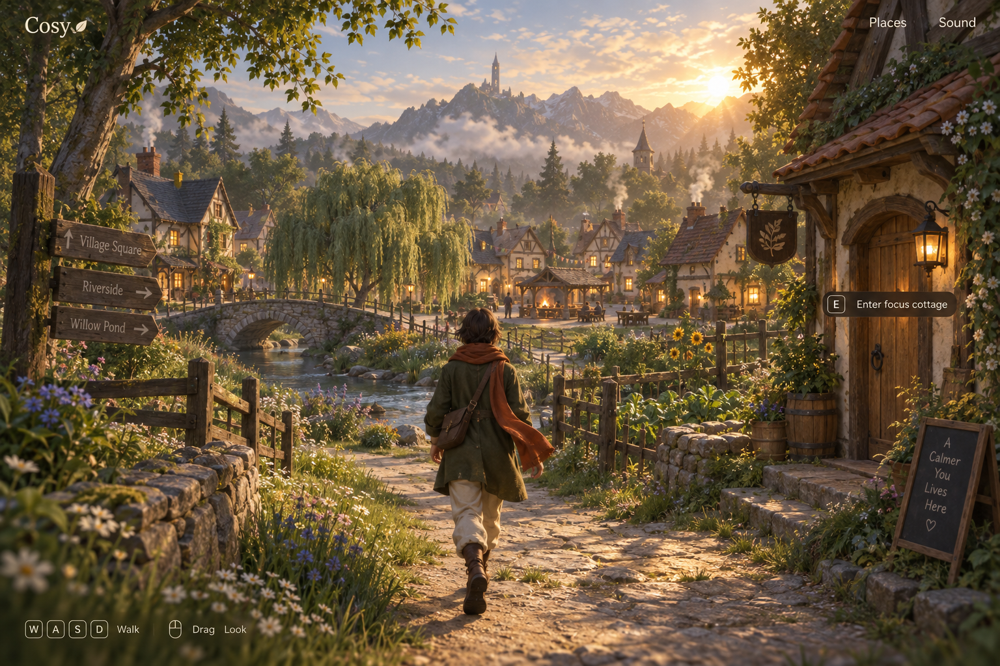
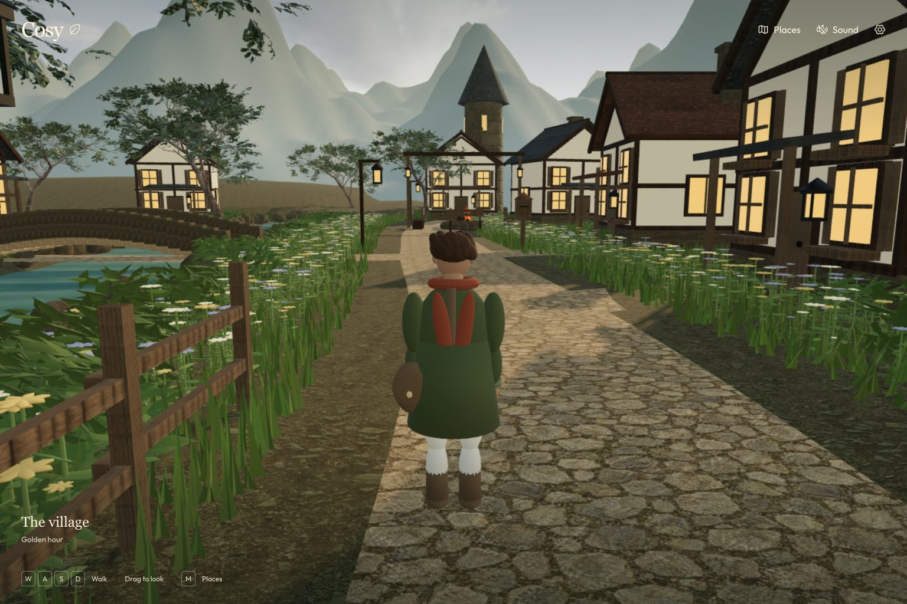

# Art direction, lighting, and asset production

Updated: 2026-09-25. Required direction for open gaps `VIS-01`, `VIS-02`, `LIGHT-01`, `PLACE-01`, and asset-related `PERF-01`. Start with the [canonical handoff](../../VILLAGE_HANDOFF.md). Everything described as a target below is future work unless explicitly listed as current.

## Current feedback fixes

The runtime now uses `atmosphere.ts` for an animated cloud sky, with golden/dusk/rain states and the existing HDR retained only for illumination. A 650 m textured terrain mesh and three mountain bands surround the village. The 640 distant birches use four-triangle crossed cards baked at runtime from the existing licensed model; this is a specific foliage LOD, not a general asset compression pipeline.

`bridge.ts` builds a solid 12 m stone arch with upward-facing paving, continuous parapets, coping stones and supported approaches. Its geometry follows the same deck-height function as movement. The flat path beneath the old crossing was removed, and planting is excluded from the deck/approaches. The hearth now occupies an open riverside clearing beside the road, with three inward-facing seats; the overlapping shelter and duplicate benches were removed. Preserve these functional arrangements while improving materials and authored detail. Four original-rig residents and twelve animated birds add ambient life.

Current views: [entrance](evidence/entrance.png), [bridge profile](evidence/bridge-side.png), [bridge deck](evidence/bridge.png), [hearth](evidence/hearth.png), [rear valley](evidence/camera-rear.png), [dusk](evidence/dusk.png) and [rain](evidence/rain.png). Captures use the final production modules at 1280×720; see [evidence provenance](evidence/README.md). Mountains, architecture, near foliage and traveler anatomy remain visibly procedural. The current 120-second high-tier sample averages about 45 fps at 720p, so added visual detail must be paired with profiling.

## Earlier candidate milestone

The earlier systems pass added an original skinned traveler and eight clips, layered cottage roofs/masonry/braces/ivy, an initial bridge, willows, a small forest/landmark layer, hearth shelter/benches, and batched cottage furnishings. It introduced CC0 [Qwantani Sunset (Pure Sky)](https://polyhaven.com/a/qwantani_sunset_puresky), 1K HDR (1,061,624 bytes), by Greg Zaal and Jarod Guest. That HDR now supplies illumination only; the feedback pass above supersedes the visible sky, bridge, backdrop and hearth arrangement.

Traveler source: `assets/village/traveller.blend`, regenerated by `scripts/village/create_traveller_rig.py`; runtime `public/village/models/traveller.glb`. See [manifest](traveller-manifest.json). Original woven texture pixels are exported directly as supported glTF base-color textures. The first preview exposed unsupported shader-node tint export; that was corrected and visually rechecked.

These are candidate assets, not approved replacements for the visual target. No lightmap bake, rigged cloth simulation, general LOD chain or compressed-asset pipeline is implemented. The later distant-birch cards are the specific LOD exception. See the current evidence in the build ledger and QA verdict before further dressing.

## The visual target



The user selected this image explicitly. Its appeal comes from composition, material detail, natural proportions, light and depth working together: a traveler framed by mature trees, a textured stone path, a stream and bridge to the left, an inviting cottage to the right, warm windows across the village, and a layered mountain/castle skyline.



This second image preserves the older prototype, **not an alternative approved style or a current-build capture**. Compare the approved image with the latest [entrance evidence](evidence/entrance.png) when reviewing new work. Existing procedural art must not become the visual standard just because it already renders.

### Art language

- Cinematic, gently stylized realism: handmade timber, irregular plaster and stone, layered slate, believable wood grain and weathering. Detail should support a coherent whole rather than make every surface equally noisy.
- Natural adult character proportions. Moss/olive clothing, a rust scarf, cream trousers, worn boots and a satchel echo the approved traveler. Produce an original design with credible anatomy and folds; avoid toy/chibi proportions.
- Warm amber sun and windows; cooler, readable shaded greens; soft cream UI. Preserve exposure headroom and surface color. “Cozy” must not become a uniform orange filter.
- Foreground framing, an inviting middle-distance destination, and multiple background depth layers. The path, bridge and building silhouettes guide the eye before signs or interface labels do.
- Restrained interface: scene first, readable corner controls, contextual interaction. Do not add title-preface labels, decorative status clutter or unnecessary fantasy HUD panels.

## Arkenfall is a heavy reference

Study [Arkenfall](https://www.arkenfall.site/) as an experience, not just a screenshot. The user specifically wants its RPG atmosphere and world sound to inform Cosy. The retained [title capture](references/arkenfall-title.jpg) is only title-screen evidence. It does not verify movement, audio quality, rendering internals, or frame rate.

The later 2026-09-25 systems pass observed the playable waterside scene at 474×683: low follow camera, swaying planting/cloth, reflective water, layered mountain silhouettes and short forward movement. It did not listen to or record reference audio; see [design QA](../../design-qa.md) for the observation record. Further targeted sessions should distinguish observations from design proposals:

| Observe and capture | Translate into Cosy |
| --- | --- |
| Camera height, distance, turning, traversal scale and framing | Comfortable third-person movement through intimate, readable village spaces. |
| How architecture, vegetation and landmarks organize a view | A strong entrance composition and distinct destinations, with limited map size. |
| Light, haze, weather and practical lamps | A coherent golden-hour default and equally intentional dusk/rain treatments. |
| Foliage, cloth, fire, water and subtle background movement | A shared environmental rhythm; no uniform synchronized swaying. |
| Audible traversal and changes between spaces | Footsteps, wind, water, fire and indoor/outdoor transitions that communicate place. |
| UI during exploration and interaction | Minimal exploration controls and calm, readable activity transitions. |

For each capture, record URL, date, state, viewport, actual observed behavior and whether sound was heard. Do not claim Arkenfall uses a particular engine, animation system, sound library or rendering technique without primary evidence. Do not copy its assets or import its combat systems into Cosy.

## Build one excellent scene first

Start at the entrance camera, then walk toward the cottage, across the bridge and into the hearth area. These views should hold up in motion and from nearby alternate angles. A single beautiful camera shot is insufficient for a walkable world.

| Priority | Asset / treatment | Production requirements |
| --- | --- | --- |
| 1 | Hero focus cottage | Layered roof edges, modeled timbers, recessed arched door/windows, stone foundation, ivy, flowers, lantern and restrained signage. Give the visible right-hand facade deliberate character. |
| 1 | Traveler | Proper topology, skinned rig, textured clothing/hair, readable silhouette; motion-ready proportions and clips in the movement spec. |
| 1 | Entrance terrain and path | Natural grading and path width variation; embedded stones, shoulders, damp edges and material blending. Avoid a repeated tile strip with identical borders. |
| 1 | Bridge and stream | Credible arch, parapets and banks; shallow water and varied stones/reeds; water response compatible with golden light. |
| 1 | Mature canopy | Several complementary broadleaf shapes, a distinctive willow, shrubs and varied ground cover. Fill the composition without excessive alpha overdraw. |
| 1 | Cottage interior | Desk, chair, fireplace, window recesses, fabrics, beams and small believable objects. Preserve timer readability and a comfortable settled camera. |
| 2 | Village kit and hearth | Compatible wall/roof/door/window kits with authored height, roofline and material variation; refine the open hearth clearing, inward-facing benches, fences and paths. Avoid nine identical houses or reintroducing an obstructing shelter. |
| 2 | Garden, pond, nook, postbox | Purpose-built focal props and planting compositions for each activity, not merely a label beside the same scenery. |
| 2 | Background layers | Tree lines, distinct rocky silhouettes, softened distant ridges and a castle landmark. Distant detail can be economical geometry/impostors if convincing from playable views. |
| 3 | Small life and weather details | Smoke, drifting leaves, subtle insects, rain impacts, flags/cloth and occasional birds only where they improve atmosphere within the budget. |

Keep furniture and set dressing grounded in plausible scale. Use worn edges and small asymmetries deliberately; random rotation/noise alone is not art direction.

## Lighting specification

Current implementation: procedural cloud sky, HDR-derived indirect lighting, a directional sun, hemisphere/ambient fill, ACES tone mapping, practical lights and bounded shadow refresh. Golden/dusk/rain coordinate sky, sun, fill and fog. That is a foundation, not evidence of finished lighting or smooth weather transitions.

1. **Match the composition first.** Position the sun to produce the approved side/back light, long soft shadows, warm edges and readable traveler silhouette. Align the visible sky and lighting direction.
2. **Build indirect light.** Use authored lightmaps/probes or another measured solution for warm bounce under eaves, around stone paths and inside rooms. If lightmaps are introduced, produce a validated second UV set with padding and document the bake. Do not simulate all bounce by raising global ambient light until shadows disappear.
3. **Separate foreground, village and distance.** Use depth-dependent atmospheric haze and layered skyline treatment. Keep nearby textures crisp and shaded foliage readable. Avoid a flat fog plane or oversized smooth mountain wall.
4. **Make materials respond correctly.** Review base color, roughness, normals and scale under neutral light and final light. Sun-warmed wood, damp stone, plaster, cloth and water should react differently. Correct color-space errors before grading.
5. **Make practical lights convincing.** Warm emissive windows and lamps need surrounding illumination where visible. Reserve real shadow-casting lights for the few views that benefit; bake or approximate the rest.
6. **Tune subtle effects last.** Bloom, contact shadows, ambient occlusion, volumetric-looking shafts and depth of field are optional tools, not substitutes for good assets. Keep navigation sharp; avoid permanent heavy blur and washed-out highlights.
7. **Treat weather as authored lighting states.** Golden, dusk and rain need coordinated sky, sun, exposure, fog, practicals, water and audio. Transitions should be smooth. Rain must not be only falling lines over unchanged sunny lighting.

Shadow refresh is bounded to 10 Hz in detailed mode and about 5.6 Hz in low mode; foliage depth shaders use the shared gust deformation. Profile the refresh frames as well as ordinary frames when refining dynamic shadows. Separate static/dynamic casters or another measured approach may help; do not leave frozen shadows on visibly moving trees or redraw every expensive light without measuring.

### Lighting evidence

Deliver matched views at the entrance, bridge, hearth, cottage exterior and interior in golden/dusk/rain. Include one slow camera/traversal recording, renderer settings, render resolution and performance measurements. Inspect highlights on water/windows, traveler readability in shade, grounding at feet, shadow movement, texture shimmer and haze banding. Compare screenshots side by side with the approved target; explain remaining differences.

## Asset pipeline and compatibility

### Current assets and tooling

- [Runtime assets](../../public/village) and [credits](../../public/village/CREDITS.txt) include CC0 Poly Haven materials/environment/tree sources, the original candidate skinned traveler, generated path texture and separately licensed piano samples. Clouds, bridge geometry, birds and resident palette/route work are original runtime additions; distant birch cards derive from the credited birch source.
- [fetch_assets.py](../../scripts/village/fetch_assets.py) retrieves the current Poly Haven and piano sources. Check its paths and licenses before expanding it.
- [prepare_tree.py](../../scripts/village/prepare_tree.py) is tailored to the current tree source and material layout. It reconstructs leaf silhouettes and simplifies bark. It is not a universal tree optimizer; indiscriminate decimation previously damaged the canopy.
- [create_traveller_rig.py](../../scripts/village/create_traveller_rig.py) generates the current candidate rig, editable [traveller.blend](../../assets/village/traveller.blend), and runtime GLB; see [traveller-manifest.json](traveller-manifest.json). The older [create_traveller.py](../../scripts/village/create_traveller.py) is a historical object-pivot prototype script, not the current character workflow.
- The prior session used an isolated background Blender process. Recheck available tooling in a new task. If using local Blender, work in a fresh file/background process; do not alter an unrelated open scene.

### Delivery contract for new 3D assets

These are proposed production conventions; verify current transforms when replacing assets.

| Property | Required delivery |
| --- | --- |
| Scale / axes | glTF in metres, +Y up; document forward direction. Proposed character convention: +Z forward, feet at local ground origin. Apply any necessary adapter at integration and remove accidental double scaling/rotation. |
| Editable source | Original `.blend` or equivalent plus reproducible export notes. Keep large production sources outside the runtime payload; document their actual location. |
| Runtime | Validated `.glb`, named objects/materials, applied transforms, predictable pivot, no missing external textures. Validate in the actual Three.js loader. |
| Materials | PBR base color, roughness, metallic where appropriate, normal, AO as appropriate. Base color/emission use sRGB; data maps use linear interpretation. Document packed channel layouts. |
| Lighting data | Keep baked sunlight out of reusable base-color maps. If using lightmaps, deliver documented UV2/bake settings and weather limitations. |
| Textures | Use the smallest resolution that survives the intended view. Trim sheets/atlases and shared materials where useful; supply mipmaps/compression plan. Avoid making every prop a unique 4K texture set. |
| Geometry | Clean normals, stable silhouettes, no invisible internal geometry; inspect at near/middle/far distances. Deliver LODs for large repeated assets. |
| Foliage | Preserve leaf clusters/canopy silhouette; document alpha cutoff, double-sided needs, wind weights and root anchoring. Limit alpha layering and shadow expense. |
| Rig / animation | Stable skeleton, named clips, rest pose and in-place/root-motion policy from the movement spec; include contact-event metadata and transition previews. |
| Integration | Simple collider proxy, bounds, entrance/interaction/sit anchors if applicable; do not rely on decorative geometry as a physics mesh. |
| Provenance | Creator/source, exact license, allowed uses, attribution, generation/tool details if generated, source hash and modifications. Unknown rights means not ready to ship. |

Initial per-asset planning ranges: traveler 30–60k visible triangles at close range; hero cottage 30–100k; large tree 10–30k at its nearest LOD, much less at distance; small props generally hundreds to a few thousand. These are **starting estimates**, not fidelity scores or permission to exceed the scene budget. Measure instanced count, overdraw, shadow passes and texture residency as well as triangles.

KTX2/Basis textures and Meshopt/Draco geometry may help delivery, but decoder integration, compressed-size measurements, load/decode time and fallback testing are required first. None should be documented as implemented merely because an export setting exists. Changes requiring new dependencies follow the task's approval rules.

### Asset manifest

Each deliverable needs a concise manifest containing:

```json
{
  "id": "focus-cottage-hero",
  "status": "candidate",
  "runtimeFile": "public/village/models/<actual-file>.glb",
  "sourceFile": "<actual-editable-source-location>",
  "creatorOrTool": "<actual source>",
  "license": "<verified license and attribution>",
  "sourceUrl": "<source URL if applicable>",
  "sha256": "<actual hash>",
  "units": "metres",
  "upAxis": "+Y",
  "forwardAxis": "+Z",
  "dimensionsMetres": [0, 0, 0],
  "lodTriangles": [],
  "textureDimensionsAndFormats": [],
  "estimatedResidentTextureBytes": 0,
  "animationClips": [],
  "colliderAndAnchorNotes": "<actual integration notes>",
  "windMaskNotes": "<actual weights or none>",
  "evidence": ["<contact sheet / preview / motion capture>"],
  "limitations": []
}
```

This is a template, not an existing asset record. Replace every placeholder and zero with measured values or explicit “not applicable”; do not invent license, geometry or memory claims.

## Generation briefs

Use the bundled approved image as reference whenever the tool supports reference input. Raster concepts/materials are not finished walkable geometry. A generated model still needs topology, UV, rig, material, license/provenance and runtime validation. Follow available generation skill instructions and disclose any tool costs before incurring costs that need authorization.

### Hero cottage concept

> Create an original cottage asset concept for the approved Cosy village. Match its warm, gently realistic fantasy craft: irregular pale plaster, dark substantial timber beams, layered weathered slate, arched wooden door, recessed warm windows, small iron lantern, climbing greenery and stone foundation. Natural human scale and believable construction. Show front, side and three-quarter views under neutral soft daylight, with consistent geometry across views. No UI, labels, watermark, theatrical fog, or baked dramatic sunlight. Preserve the silhouette and material family of the reference without copying a proprietary game asset.

### Traveler turnaround and rig brief

> Create an original natural-proportioned adult traveler matching the approved scene: muted moss coat, rust scarf, cream trousers, worn boots and a practical satchel. Relaxed, approachable silhouette; convincing anatomy, hands, hair and layered cloth. Provide consistent front, side and back turnaround in a neutral rigging pose with soft neutral light. Avoid toy proportions, armor and weapons. Design scarf/coat sections so they can be rigged for modest wind and movement. Final 3D delivery also requires a skinned mesh and the named locomotion/jump clips in MOVEMENT_AND_WORLD.md; this image alone is only a concept.

### Vegetation family

> Produce a cohesive original temperate village planting set: mature broadleaf canopy, a graceful willow, shrubs, meadow grasses and restrained wildflowers. Follow the approved image's lush natural density and warm/cool green variation. Vary age, silhouette, clump size and growth direction. Supply readable isolated views suitable for modeling. Avoid identical rounded tree blobs, evenly spaced flower rows and neon greens. 3D delivery must preserve the canopy at distance with documented LODs, alpha treatment and wind masks.

### Tileable material

> Generate a seamless, top-down material source for [specific material] at [real-world repeat size], consistent with the approved village. Even neutral lighting; no perspective, directional cast shadows, baked highlights, objects, text or border. Plausible scale and restrained variation. Derive and inspect physically meaningful roughness/normal/height maps in a separate material workflow; do not label arbitrary image channels as validated PBR data.

## Asset and art acceptance

An asset is ready only after source/license checks, technical validation, a neutral-light inspection, a final-light inspection, and actual in-engine near/far/motion views. Test a group of assets together for scale, texel density and style consistency. A beautiful isolated render cannot certify the village composition or frame time.

Update [design QA](../../design-qa.md) with fresh evidence after integration. Keep unfinished assets labeled as candidates and preserve the approved target; do not quietly redefine success around whatever the generator happened to produce.
